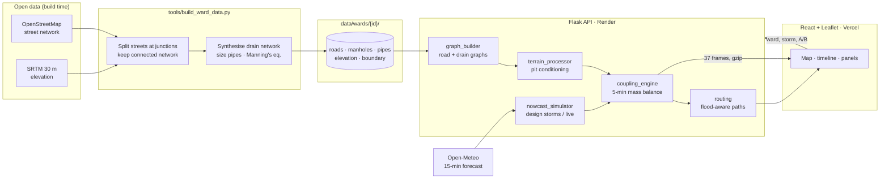
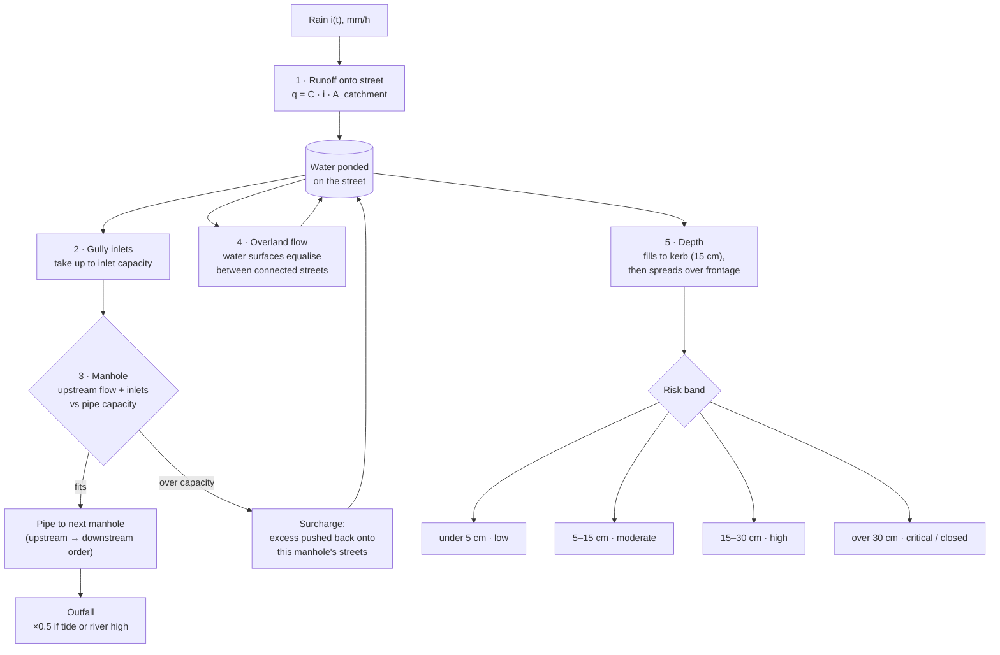
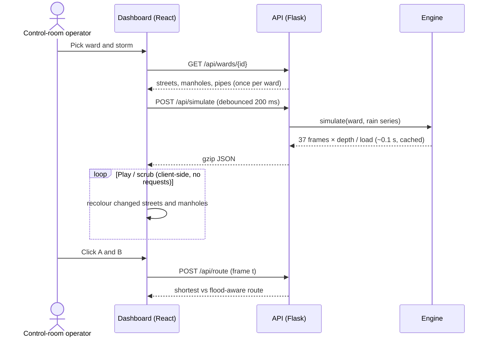
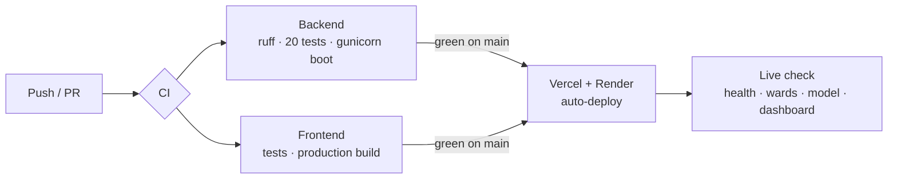

<div align="center">

# DrainCast

### Which streets will flood, when, how deep, and why: 0–3 hours ahead

**Street-level urban flood nowcasting through rainfall–drainage–terrain coupling**
Smart India Hackathon 2026 · Problem Statement **26085**

[](https://github.com/samudragupto/drain-cast/actions/workflows/ci.yml)
[](https://github.com/samudragupto/drain-cast/actions/workflows/live-check.yml)


**[Open the live dashboard →](https://drain-cast.vercel.app)** &nbsp;·&nbsp; [API health](https://drain-cast.onrender.com/api/health) &nbsp;·&nbsp; [Methodology](docs/METHODOLOGY.md) &nbsp;·&nbsp; [API docs](docs/API_DOCS.md)

</div>

> The API runs on Render's free tier and sleeps when idle. If the dashboard says *Backend offline*, wait about 30 seconds while it wakes up.

---

## The problem

Every monsoon, Indian cities flood street by street, not city-wide. One underpass fills while the road beside it stays dry. The difference comes from three things that no current forecast combines:

| What exists today | What it tells you | What it cannot tell you |
|---|---|---|
| IMD rainfall forecasts and nowcasts | *How much* rain, over a district | Which street goes under, and when |
| Static waterlogging hotspot lists | Where it flooded *last year* | Whether it floods *today*, at *this* intensity |
| 2D hydraulic models (SWMM, HEC-RAS) | Detailed depths | Answers in time: they take hours to run and need specialists |

**DrainCast couples live rainfall with the storm-drain network and the terrain.** For every street segment in a ward it predicts water depth every 5 minutes for the next 3 hours, and explains which drain is the bottleneck. A full run takes about 0.1 s.

## Who uses it, and for what

| User | Question they have in a storm | What DrainCast gives them |
|---|---|---|
| **Traffic police** | Where do I put barricades, and when? | *Next to cross 15 cm* list with exact times. Two-wheelers stall at 15 cm, so divert before then. |
| **Fire and ambulance control rooms** | How does the vehicle get through? | Flood-aware routing that closes roads over 30 cm, penalises 15–30 cm, and re-plans as the water moves. |
| **Ward disaster cell** | Where do dewatering pumps and crews go first? | Overloaded manholes and the streets they back up into, ranked by depth. |
| **Storm-water drain engineers** | Which drains do we desilt or upsize before the monsoon? | Bottleneck pipes that flood streets *upstream* of themselves, shown under design storms. |
| **Residents' associations** *(roadmap)* | Should I move my car or my stock now? | A per-street time to 15 cm, which can become an SMS or WhatsApp alert. |

### A typical storm, step by step

1. **17:40.** IMD issues a nowcast for heavy rain over south Chennai. The Velachery ward cell switches DrainCast to *Live forecast*, or picks *Cloudburst, 75 mm/h*.
2. The situation panel shows what is coming: about 420 segments over 15 cm (22 km of road) within an hour, and 78 of 214 manholes overloaded.
3. **Street detail** for the top hotspot shows its gullies can cope, but a pipe downstream is over capacity. The fix is at that manhole, so a pump goes there.
4. Traffic police get the *next to cross 15 cm* list and close those roads 20–40 minutes before the water arrives.
5. An ambulance crossing the ward is given the flood-aware route: a little longer, and it avoids the streets predicted above 15 cm.
6. **High tide or the Adyar in spate?** One toggle halves outfall capacity, and the map shows the extra streets that go under.

## What's on screen

- **Map.** 4,152 real street segments, each coloured by predicted depth. Manholes turn amber near capacity and red when they overflow. The pipe network can be switched on.
- **Timeline.** Play, pause and scrub from *Now* to *+3 h* in 5-minute steps at 1×, 2× or 4×, with looping. Times are shown in IST. Keys: `Space`, `←`, `→`.
- **Rainfall.** Four design-storm shapes (steady, building, cloudburst, passing) at 5–150 mm/h, or the live Open-Meteo 15-minute forecast. The rain chart shows the drains' design intensity as a red line.
- **Situation.** Flooded length, deepest point, overloaded drains, worst-hit streets, and the next streets to flood.
- **Street detail.** A depth curve, peak depth and time, the times it crosses 15 cm and 30 cm, runoff against gully capacity, the downstream bottleneck with pipe size and condition, and terrain.
- **Routing.** Click A and B on the map to compare the shortest and flood-aware routes, with length, travel time and roads avoided. The routes update as the timeline moves.

## Coverage

| Ward | City | Street segments | Road length | Manholes | Drain design standard |
|---|---|---:|---:|---:|---|
| Kurla East | Mumbai | 901 | 53.0 km | 167 | 25 mm/h (legacy BMC), tidal outfalls |
| T. Nagar | Chennai | 624 | 46.1 km | 152 | 35 mm/h (assumed), canal outfalls |
| Velachery | Chennai | 1,099 | 66.8 km | 214 | 35 mm/h (assumed), lake and marsh |
| Saidapet | Chennai | 892 | 56.7 km | 185 | 35 mm/h (assumed), Adyar river |
| West Tambaram | Chennai | 636 | 41.8 km | 145 | 30 mm/h (assumed), lakes and channels |
| **Total** | | **4,152** | **264.4 km** | **863** | |

A new ward is one entry in `tools/build_ward_data.py` plus one command. See [Adding a ward](#adding-a-ward).

## Architecture



## How the model works

Every 5 minutes, for every street segment:



Three details make the results believable:

- **Surcharge at bottlenecks.** Manholes are solved from upstream to downstream. A street can flood even when its own drains are fine, because a pipe further down is full and pushes water back up. That is how urban flooding actually spreads, and the street panel names the manhole responsible.
- **Terrain that doesn't lie.** Raw SRTM has metre-scale noise in dense cities, which creates fake pits. We run a priority-flood from the ward edge and cap pits at 0.6 m. Real underpasses and low junctions survive; the noise does not.
- **Water is conserved.** Rain in = water to outfalls + water on streets + water that left the ward overland. A test checks this every run.

Full equations, parameters and assumptions: **[docs/METHODOLOGY.md](docs/METHODOLOGY.md)**.

## Request flow



## Engineering quality

| | |
|---|---|
| **Backend tests** | 20 tests: mass conservation, monotonic response to rain, backwater never helps, routing never uses closed roads, API contracts and validation, and data integrity for every ward (connected streets, acyclic drains, geometry inside the ward) |
| **Frontend tests** | Risk bands, IST time formatting, street-labelling logic |
| **CI** ([`ci.yml`](.github/workflows/ci.yml)) | ruff lint, all backend tests, a boot under gunicorn with real API calls, frontend tests, and a production build in which lint warnings fail the build |
| **CD** | Vercel and Render redeploy from `main`. [`live-check.yml`](.github/workflows/live-check.yml) then smoke-tests the public URLs after every green CI run. |
| **Performance** | 73–132 ms per 3-hour run per ward. Results are memoised, responses are gzipped, and the map redraws on canvas, restyling only the streets whose risk band changed. |
| **Honesty** | Every modelling assumption is listed in the methodology, and the dashboard itself says the drain network is synthesised |



## Data

| Layer | Source | Notes |
|---|---|---|
| Streets | OpenStreetMap via Overpass | Split at junctions; unnamed lanes are labelled by the nearest named road ("Lane off SG Barve Marg") |
| Terrain | SRTM 30 m via OpenTopoData | Sampled at every junction and segment midpoint, smoothed, then pit-conditioned |
| Rain | Design storms, or Open-Meteo `minutely_15` | Open-Meteo is model output, not radar; an IMD nowcast plugs into the same function |
| Drainage | **Synthesised** | Municipal drain GIS isn't public. Manholes are placed at junction clusters and pipes are routed downhill to the lowest outfalls. Pipes are sized with the rational method and Manning's equation for each ward's design standard, then de-rated for silt; about 12% are marked as legacy or undersized. |

With the corporation's real drain survey, only the drainage step is replaced. The engine reads manholes and pipes from plain JSON.

## Run it locally

Requirements: Python 3.10+, Node 18+.

```bash
# API on :5000
cd backend
python -m venv venv
venv\Scripts\activate          # macOS/Linux: source venv/bin/activate
pip install -r requirements.txt
python app.py
```

```bash
# Dashboard on :3000 (proxies /api to :5000)
cd frontend
npm install
npm start
```

```bash
# Checks (the same as CI)
ruff check .
cd backend && python -m unittest discover -s tests -v
cd frontend && npm test -- --watchAll=false && npm run build
```

More detail and troubleshooting: [docs/SETUP.md](docs/SETUP.md).

### Adding a ward

1. Add an entry to `WARDS` in `tools/build_ward_data.py`: bounding box, runoff coefficient, drain design intensity, condition factor and notes.
2. Run `python tools/build_ward_data.py <ward-id>`. It downloads OSM and SRTM and caches them in `tools/.cache/`.
3. Run the tests. `tests/test_data.py` rejects a ward whose streets are disconnected or whose drains form a loop.

## Deployment

| Part | Host | Settings |
|---|---|---|
| API | Render (free) | Root `backend` · build `pip install -r requirements.txt` · start `gunicorn app:app --workers 1 --threads 4 --timeout 120` · health `/api/health` · `PYTHON_VERSION=3.10.14` (also in [`render.yaml`](render.yaml)) |
| Dashboard | Vercel | Root `frontend` · Create React App preset · `REACT_APP_API_URL=https://<api-host>/api` |

## API at a glance

| Endpoint | Purpose |
|---|---|
| `GET /api/health` | Liveness |
| `GET /api/wards` | Wards, storm patterns, data sources |
| `GET /api/wards/<id>` | Streets, manholes, pipes |
| `POST /api/simulate` | 3-hour run: depth per street and load per manhole every 5 min |
| `POST /api/predict` | Snapshot at +0/1/2/3 h |
| `POST /api/route` | Shortest vs flood-aware route at a time step |
| `GET /api/ward-info?ward=` | Ward statistics |
| `GET /api/rainfall/live?ward=` | The live forecast series |

Schemas and examples: [docs/API_DOCS.md](docs/API_DOCS.md).

## Two-minute demo

1. **0:00 · Velachery.** "Every line is a real street; colour is predicted water. The red line on the rain chart is what these drains were built for."
2. **0:15 · Cloudburst, 75 mm/h, press Play.** "Rain crosses the design line, manholes go amber then red, and flooding spreads out from the low ground by the lake."
3. **0:45 · Pause at +1 h, click the top hotspot.** "Here is when this street crosses 15 cm, and why: its own gullies cope, but a manhole downstream is over capacity."
4. **1:10 · Set A and B.** "The shortest route runs through flooded streets. The flood-aware route is a little longer and stays shallow, and it re-plans as the timeline moves."
5. **1:35 · Tick 'outfalls blocked', switch to Kurla East.** "High tide closes Mumbai's outfalls. Same rain, more flooding. A rain-only forecast misses exactly that."
6. **1:50 · Close.** "Five wards in two cities from open data. Plug in the drain survey and IMD radar, and it runs on any ward."

## Project structure

```
drain-cast/
├── backend/                 Flask API and flood engine
│   ├── app.py               endpoints, validation, gzip
│   ├── coupling_engine.py   5-min rainfall–drainage–terrain mass balance
│   ├── graph_builder.py     loads a ward, builds road + drain graphs
│   ├── terrain_processor.py adjacency, pit conditioning, outlets
│   ├── nowcast_simulator.py design storms, Open-Meteo
│   ├── routing.py           shortest vs flood-aware routes
│   └── tests/               engine, API and data-integrity tests
├── frontend/src/
│   ├── components/          Map, TimelineBar, ControlPanel, RainChart, SummaryPanel,
│   │                        InfoPanel, RoutePanel, Legend, Header
│   └── utils/               API client, risk styles, formatting (+ tests)
├── data/wards/<id>/         roads, manholes, pipes, elevation, boundary
├── tools/build_ward_data.py OSM + SRTM → ward datasets
├── docs/                    METHODOLOGY · ARCHITECTURE · API_DOCS · SETUP
└── .github/workflows/       ci.yml · live-check.yml
```

## Limitations

This is a screening model, not a design tool, and it has **not yet been validated against observed flood depths**.
- The drains are synthesised.
- SRTM carries noise in dense areas.
- Pipes have no storage and no backwater along their length.
- Each run starts from a dry network 30 minutes before *now*.
- Water from outside the ward box is ignored.

Use it to **rank streets and time decisions**, not to quote exact centimetres. The methodology lists each limitation and how real data removes it.

## Roadmap

- [ ] Ingest corporation SWD GIS (BMC, GCC) in place of the synthesised network
- [ ] Calibrate against logged waterlogging points from recent monsoons
- [ ] IMD Doppler radar nowcasts, Mumbai tide tables and Adyar river gauges as live inputs
- [ ] IoT water-level sensors at bottleneck manholes for real-time correction
- [ ] Per-street SMS / WhatsApp alerts for residents and traffic control
- [ ] Citywide scale-out with PostGIS and vector tiles

## Acknowledgements

Ministry of Earth Sciences · India Meteorological Department · Smart India Hackathon 2026.
Map data © OpenStreetMap contributors (ODbL). Basemap © Esri. Elevation: NASA SRTM via OpenTopoData. Forecasts: Open-Meteo.

Released under the [MIT License](LICENSE).
